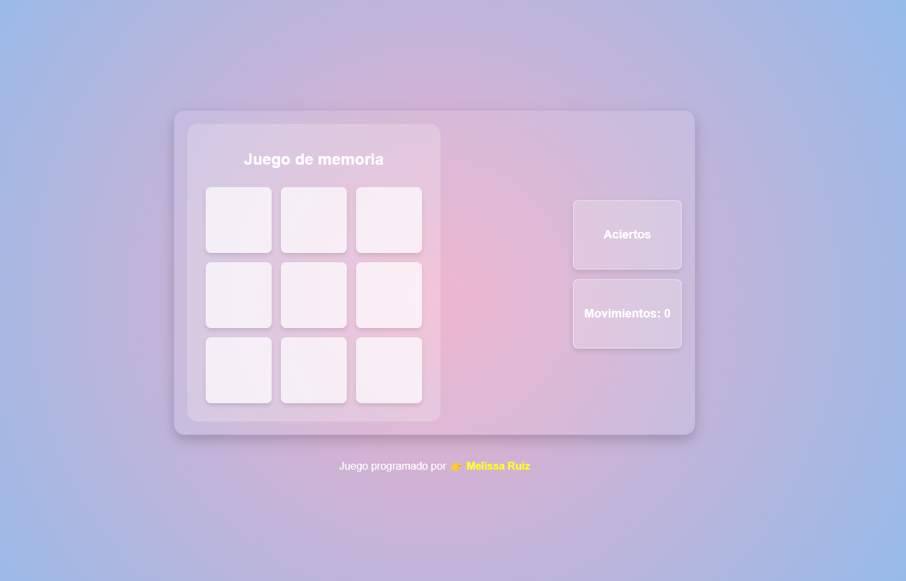

## Juego de memoria
La idea de la actividad javascript es ir haciendo parejas de números.

Empezamos con un casillero de 9 casillas con 4 parejas de números ocultos. Cuando el usuario hace clic en una casilla puede ver el número que tiene esa casilla y se contabiliza como un intento. Eso implica que como mínimo habrá 9 intentos

Si después de pulsar en una casilla se hace clic en otra que tenga el mismo número entonces se habrá acertado una de las parejas y ya se muestra todo el tiempo los números de esas dos casillas hasta que finalice ese nivel.

Si se supera un nivel ( conseguir marcar todas las parejas de números en una cantidad de intentos determinada. Por ejemplo, para 9 casillas podrían ser 16 ) Entonces se recrea un nuevo tablero con nuevas parejas de números, pasando de un tablero de 3x3 a un tablero de 4x4  

 Debe hacerse como mínimo 3 niveles

    hace falta conocer:
    document.querySelectorALL para buscar en el DOM
    Math.trunc(), Math.pow() para tener un entero truncado y potencias
    document.createElement()   para generar nuevos div
    element.classList.add()  para agregar una clase a los div
    element.classList.remove() para quitar una clase
    element.onclick = nombreFuncion;  observar que no lleva paréntesis y asignamos el método al elemento
    DOM.tablero.setAttribute('style','loquesea');  para agregar un atributo a un elemento. Observar
        que es a nivel de atributo style del elemento así que se superpone a cualquier otro CSS
    function f(evt){
        let divActual = evt.target;
    } // para capturar el source del evento
    //

